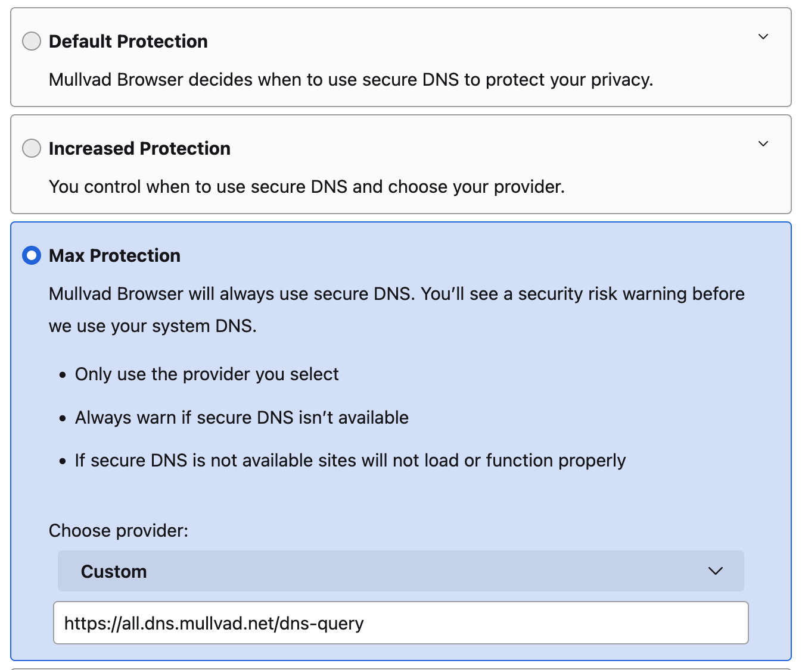
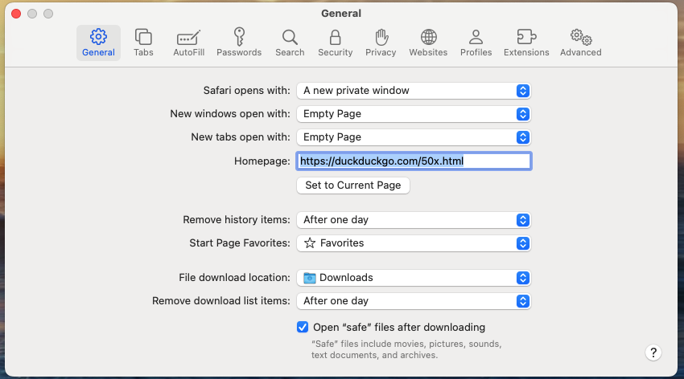
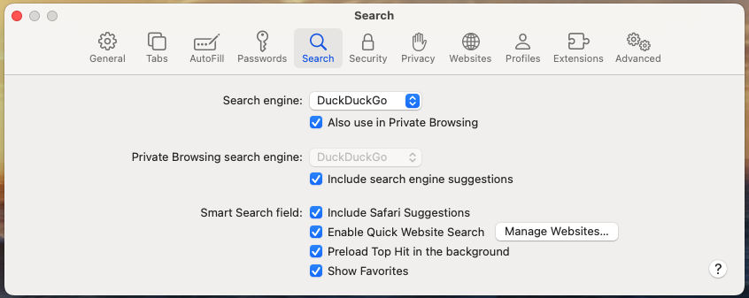
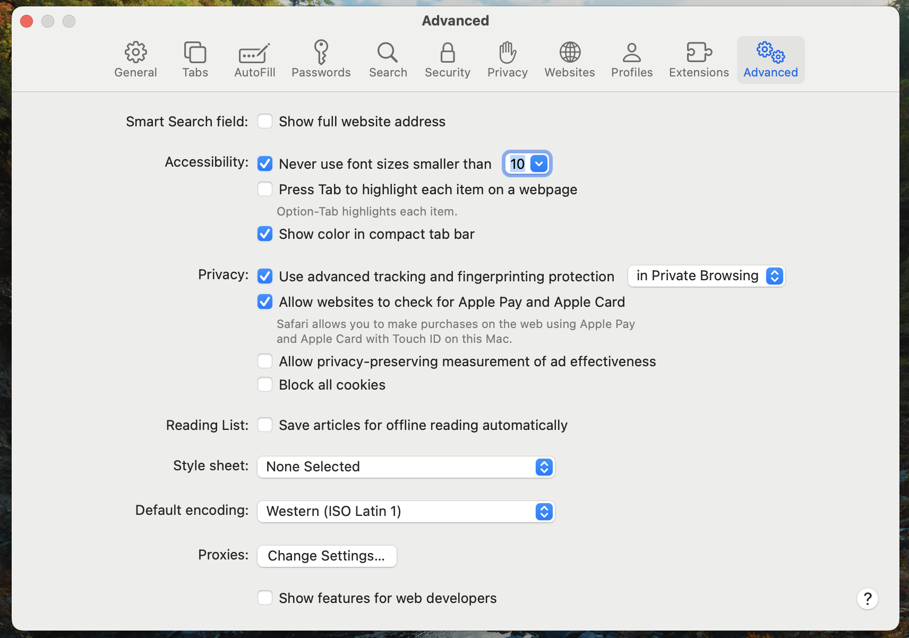
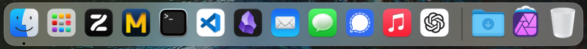

My simple step by step instructions to quickly setup macOS quickly. Used to have scripts but they broke and for the number of times I setup MacOS its probably just easier to have a step by step guide. 

Start by updating the OS to latest version.
## Brew
1. Install [Brew](https://brew.sh) `/bin/bash -c "$(curl -fsSL https://raw.githubusercontent.com/Homebrew/install/HEAD/install.sh)"`
2. export brew to `~/.zshrc` or whatever (brew should tell you)

## Install Custom Settings
This will install 
1. Custom Scripts (pulled from github)
2. Fonts for Terminal
3. Terminal Themes (will save to desktop)
4. Vim Themes (TODO)
5. Setup GPG
6. Install Age encryption
7. Install pass (linux password manager)
8. Setup ssh (will need to add public key manually to all other servers)
### Run Install.sh
Run `install.sh` this will set up everything for you.
Optionally install: `brew install ffmpeg yt-dlp` 

## Private
Install GPG/AGE keys from `backup.tar.gpg`
Using `private.tar.gpg`, found on external hdd's, usb, cd's.
1. Place `private.tar.gpg` on the desktop
2. Plug in usb-c yubikey.
3. run `ubackup`. 

## Internet
Download 3 Browsers: Zen, Mullvad, Tor. Setup Safari
### Zen
1. Download [Zen](https://www.zen-browser.app/download) 
2. Follow Guide (`xattr -c '/Applications/Zen Browser.app/'`)
3. Sign into Google/Youtube using security key

### Mullvad 
1. Download [Mullvad](https://mullvad.net/en/browser). [Browser][https://mullvad.net/en/download/browser], [VPN](https://mullvad.net/en/download/vpn/macos). Both are in the downloads section
2. Sign into VPN `pass -c wifi/vpn` 
3. Set Mullvad as default web browser. Search `default browser` and change it.
4. Set to custom DNS [Options](https://mullvad.net/en/help/dns-over-https-and-dns-over-tls) `https://all.dns.mullvad.net/dns-query`    
7. Set as default search `default web browser` 

### Tor
1. Download [Tor](https://www.torproject.org)
2. I don't verify (probably should)

### Safari
1. Settings > General:
    - New Private Window
    - Empty page
    - Homepage: https://duckduckgo.com/50x.html
    - Remove History: one day  
2. Settings > Search
    - Search Engine: DuckDuckGo  
3. Advanced  
## Comms
Install Signal, Protonmail
### Signal
1. Download [Signal](https://signal.org)
2. Sign into Signal, will need phone

### Protonmail
1. Navigate to [Proton](https://account.proton.me/login?language=en)
2. Add to Dock

OR...
1. Download [Bridge](https://proton.me/mail/bridge)
2. Sign in (password should be in keychain)
3. Need 2FA app, desktop currently doesn't support passkeys. Found in `recovery.tar.gpg`.

## Obsidian 
1. Download [Obsidian](https://obsidian.md)
2. Point to vault `~/Documents/Obsidian\ Vault`

## OnionShare
1. Download [OnionShare](https://onionshare.org/#download) 

## TailScale
1. Download from Apple Appstore
2. Sign in on Zen using Google Account

## ChatGPT
1. Navigate to [ChatGPT](https://chatgpt.com)
2. Box with up arrow > Add to Dock
3. Open and sign in using AppleID

## VS Code
1. [Download](https://code.visualstudio.com/)
2. Add `export PATH="$PATH:/Applications/Visual Studio Code.app/Contents/Resources/app/bin"` to `~/.crc`.

## Affinity
Photo editing Software
1. Download from [Link](https://affinity.serif.com/en-us/)
2. Sign in, password is `serif.com`

## DVD Ripping
Want to be able to rip DVD's
### MakeMKV
1. Download from [Link](https://www.makemkv.com/download/)
2. Get product key from [Link](https://forum.makemkv.com/forum/viewtopic.php?t=1053)
### HandBrake
1. Download from [Link](https://handbrake.fr/)
2. Make custom Preset, Use hardware encoder and FLAC. 

## Uninstall Crap
Just uninstall whatever crap you don't need.

## Setup Bar

 